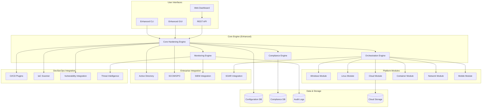

# Design Document

## Overview

The Security Hardening Tool Enhancements extend the existing cross-platform security hardening tool with next-generation capabilities including cloud platform support, enterprise integration, container/Kubernetes security, advanced compliance frameworks, real-time monitoring, and DevSecOps integration. The enhanced architecture maintains backward compatibility while introducing modular extensions that can be deployed independently based on organizational needs.

The design follows a plugin-based microservices architecture where new capabilities are implemented as independent modules that integrate with the existing core engine through well-defined interfaces. This approach ensures scalability, maintainability, and allows for selective deployment of features.

## Architecture

### Enhanced High-Level Architecture



### Cloud Platform Architecture

```mermaid
graph TB
    subgraph "Cloud Module"
        CloudDetector[Cloud Platform Detector]
        CloudManager[Cloud Configuration Manager]
        CloudCompliance[Cloud Compliance Engine]
    end
    
    subgraph "AWS Integration"
        EC2Manager[EC2 Hardening]
        IAMManager[IAM Configuration]
        SecurityGroups[Security Groups]
        CloudTrail[CloudTrail Config]
    end
    
    subgraph "Azure Integration"
        VMManager[VM Hardening]
        AADManager[Azure AD Config]
        NSGManager[Network Security Groups]
        SecurityCenter[Security Center]
    end
    
    subgraph "GCP Integration"
        ComputeManager[Compute Engine]
        IAMGCPManager[GCP IAM]
        FirewallManager[VPC Firewall]
        SecurityCommand[Security Command Center]
    end
    
    CloudDetector --> CloudManager
    CloudManager --> CloudCompliance
    
    CloudManager --> EC2Manager
    CloudManager --> IAMManager
    CloudManager --> SecurityGroups
    CloudManager --> CloudTrail
    
    CloudManager --> VMManager
    CloudManager --> AADManager
    CloudManager --> NSGManager
    CloudManager --> SecurityCenter
    
    CloudManager --> ComputeManager
    CloudManager --> IAMGCPManager
    CloudManager --> FirewallManager
    CloudManager --> SecurityCommand
```



## Components and Interfaces

### Enhanced Core Engine Interface

```python
class EnhancedHardeningEngine(HardeningEngine):
    def register_cloud_module(self, provider: CloudProvider, module: CloudHardeningModule) -> None
    def register_container_module(self, runtime: ContainerRuntime, module: ContainerHardeningModule) -> None
    def enable_real_time_monitoring(self, config: MonitoringConfig) -> MonitoringSession
    def integrate_vulnerability_scanner(self, scanner: VulnerabilityScanner) -> None
    def configure_compliance_frameworks(self, frameworks: List[ComplianceFramework]) -> None
    def setup_enterprise_integration(self, config: EnterpriseConfig) -> None
    def execute_risk_based_assessment(self, threat_model: ThreatModel) -> RiskAssessmentResult
    def deploy_centralized_policies(self, policy_set: PolicySet, targets: List[Target]) -> DeploymentResult
```

### Cloud Hardening Module Interface

```python
class CloudHardeningModule(ABC):
    @abstractmethod
    def detect_cloud_platform(self) -> CloudPlatformInfo
    
    @abstractmethod
    def get_cloud_security_controls(self) -> List[CloudSecurityControl]
    
    @abstractmethod
    def assess_cloud_configuration(self, controls: List[CloudSecurityControl]) -> CloudAssessmentResult
    
    @abstractmethod
    def apply_cloud_hardening(self, controls: List[CloudSecurityControl]) -> CloudHardeningResult
    
    @abstractmethod
    def integrate_cloud_native_services(self, services: List[CloudService]) -> IntegrationResult
    
    @abstractmethod
    def backup_cloud_configuration(self) -> CloudBackupData
    
    @abstractmethod
    def restore_cloud_configuration(self, backup: CloudBackupData) -> CloudRestoreResult
```

### Container Security Module Interface

```python
class ContainerHardeningModule(ABC):
    @abstractmethod
    def detect_container_runtime(self) -> ContainerRuntimeInfo
    
    @abstractmethod
    def scan_container_images(self, images: List[ContainerImage]) -> ImageScanResult
    
    @abstractmethod
    def assess_kubernetes_cluster(self, cluster: KubernetesCluster) -> K8sAssessmentResult
    
    @abstractmethod
    def apply_container_hardening(self, policies: List[ContainerPolicy]) -> ContainerHardeningResult
    
    @abstractmethod
    def configure_pod_security_standards(self, standards: PodSecurityStandards) -> PSSResult
    
    @abstractmethod
    def implement_network_policies(self, policies: List[NetworkPolicy]) -> NetworkPolicyResult
```

### Real-Time Monitoring Interface

```python
class MonitoringEngine:
    def start_configuration_monitoring(self, targets: List[MonitoringTarget]) -> MonitoringSession
    def detect_configuration_drift(self, baseline: SecurityBaseline) -> List[DriftEvent]
    def send_real_time_alerts(self, events: List[SecurityEvent], channels: List[AlertChannel]) -> None
    def integrate_with_siem(self, siem_config: SIEMConfig) -> SIEMIntegration
    def correlate_security_events(self, events: List[SecurityEvent]) -> CorrelationResult
    def trigger_automated_response(self, event: SecurityEvent, response_policy: ResponsePolicy) -> None
```

### Enterprise Integration Interface

```python
class EnterpriseIntegration:
    def authenticate_with_active_directory(self, ad_config: ADConfig) -> ADSession
    def deploy_via_group_policy(self, policies: List[GroupPolicy], targets: List[ADTarget]) -> GPOResult
    def integrate_with_sccm(self, sccm_config: SCCMConfig) -> SCCMIntegration
    def generate_executive_dashboard(self, compliance_data: ComplianceData) -> Dashboard
    def manage_role_based_access(self, rbac_config: RBACConfig) -> RBACResult
```

## Data Models

### Cloud Security Control Model

```python
@dataclass
class CloudSecurityControl:
    control_id: str
    cloud_provider: CloudProvider
    service_type: str  # EC2, IAM, Security Groups, etc.
    control_name: str
    description: str
    cis_benchmark_reference: str
    compliance_frameworks: List[str]  # SOC2, PCI-DSS, etc.
    current_configuration: Dict[str, Any]
    recommended_configuration: Dict[str, Any]
    risk_level: RiskLevel
    implementation_complexity: ComplexityLevel
    business_impact: ImpactLevel
```

### Container Security Assessment Model

```python
@dataclass
class ContainerAssessmentResult:
    container_id: str
    image_name: str
    runtime_type: ContainerRuntime
    security_findings: List[SecurityFinding]
    cis_kubernetes_compliance: CISComplianceResult
    vulnerability_scan_results: VulnerabilityScanResult
    pod_security_standard_compliance: PSSComplianceResult
    network_policy_compliance: NetworkPolicyCompliance
    rbac_assessment: RBACAssessment
```

### Compliance Framework Model

```python
@dataclass
class ComplianceFramework:
    framework_id: str
    framework_name: str  # SOC2, PCI-DSS, HIPAA, etc.
    version: str
    control_mappings: Dict[str, List[str]]  # Maps security controls to framework requirements
    evidence_requirements: List[EvidenceRequirement]
    audit_trail_requirements: AuditTrailRequirement
    reporting_templates: List[ReportTemplate]
    scoring_methodology: ScoringMethod
```

### Real-Time Monitoring Model

```python
@dataclass
class SecurityEvent:
    event_id: str
    timestamp: datetime
    event_type: EventType  # DRIFT_DETECTED, POLICY_VIOLATION, etc.
    source_system: str
    affected_controls: List[str]
    severity: Severity
    risk_score: float
    event_details: Dict[str, Any]
    correlation_id: Optional[str]
    response_actions: List[ResponseAction]
```

### Risk Assessment Model

```python
@dataclass
class RiskAssessmentResult:
    assessment_id: str
    threat_model: ThreatModel
    asset_inventory: List[Asset]
    vulnerability_analysis: VulnerabilityAnalysis
    threat_analysis: ThreatAnalysis
    risk_calculations: List[RiskCalculation]
    prioritized_controls: List[PrioritizedControl]
    risk_mitigation_plan: RiskMitigationPlan
    roi_analysis: ROIAnalysis
```

## Error Handling

### Enhanced Error Categories

1. **Cloud Integration Errors**: API authentication, service limits, regional availability
2. **Container Runtime Errors**: Docker daemon issues, Kubernetes API connectivity
3. **Enterprise Integration Errors**: AD authentication, GPO deployment failures
4. **Monitoring Errors**: SIEM connectivity, alert delivery failures
5. **Compliance Errors**: Framework mapping issues, evidence collection failures

### Advanced Error Handling Strategy

```python
class EnhancedErrorHandler(ErrorHandler):
    def handle_cloud_error(self, error: CloudError) -> CloudErrorResponse
    def handle_container_error(self, error: ContainerError) -> ContainerErrorResponse
    def handle_enterprise_error(self, error: EnterpriseError) -> EnterpriseErrorResponse
    def handle_monitoring_error(self, error: MonitoringError) -> MonitoringErrorResponse
    def suggest_alternative_approaches(self, error: HardeningError) -> List[AlternativeApproach]
    def escalate_critical_errors(self, error: CriticalError) -> EscalationResult
```

## Testing Strategy

### Cloud Platform Testing

- **Multi-Cloud Validation**: Testing across AWS, Azure, and GCP environments
- **Cloud Service Integration**: Validation of cloud-native security services
- **API Rate Limiting**: Testing behavior under API throttling conditions
- **Cross-Region Testing**: Validation across different cloud regions

### Container Security Testing

- **Runtime Compatibility**: Testing with Docker, containerd, CRI-O
- **Kubernetes Versions**: Validation across multiple K8s versions
- **CIS Benchmark Compliance**: Automated validation against CIS Kubernetes Benchmark
- **Pod Security Standards**: Testing PSS enforcement and compliance

### Enterprise Integration Testing

- **Active Directory Integration**: Multi-domain and forest testing
- **Group Policy Deployment**: Testing GPO creation and distribution
- **SCCM Integration**: Package deployment and reporting validation
- **Scale Testing**: Testing with thousands of endpoints

### Real-Time Monitoring Testing

- **Event Processing**: High-volume event ingestion and processing
- **Alert Delivery**: Multi-channel alert delivery testing
- **SIEM Integration**: Testing with major SIEM platforms
- **Drift Detection**: Accuracy testing for configuration changes

### Compliance Framework Testing

- **Framework Mapping**: Validation of control mappings across frameworks
- **Evidence Collection**: Automated evidence gathering and validation
- **Report Generation**: Multi-framework report accuracy testing
- **Audit Trail Integrity**: Tamper-evident logging validation

### Performance and Scalability Testing

```python
class EnhancedTestSuite:
    def test_cloud_platform_integration(self, cloud_providers: List[CloudProvider]) -> TestResult
    def test_container_security_scanning(self, container_environments: List[ContainerEnv]) -> TestResult
    def test_enterprise_scale_deployment(self, endpoint_count: int) -> TestResult
    def test_real_time_monitoring_performance(self, event_volume: int) -> TestResult
    def test_compliance_framework_accuracy(self, frameworks: List[ComplianceFramework]) -> TestResult
    def test_risk_assessment_algorithms(self, threat_scenarios: List[ThreatScenario]) -> TestResult
```

### Security Testing

- **Privilege Escalation**: Testing security of elevation mechanisms
- **Data Encryption**: Validation of data protection in transit and at rest
- **Authentication Security**: Multi-factor authentication and SSO testing
- **API Security**: Testing of REST API security controls
- **Audit Trail Security**: Tamper-evident logging and integrity validation

### Integration Testing Scenarios

- **Hybrid Cloud Environments**: Testing across on-premises and cloud
- **Multi-Platform Deployments**: Windows, Linux, containers simultaneously
- **DevSecOps Pipeline Integration**: End-to-end CI/CD security testing
- **Incident Response Integration**: SOAR platform integration testing
- **Compliance Audit Simulation**: Full audit trail and evidence collection testing