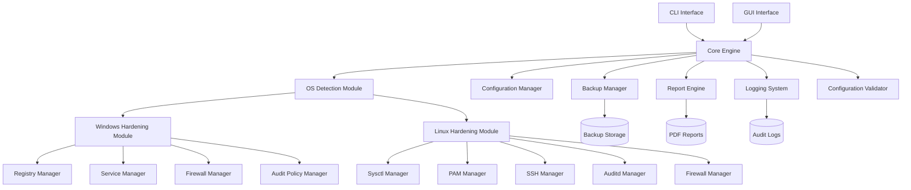

# Design Document

## Overview

The Cross-Platform Security Hardening Tool is designed as a modular, extensible system that automates the application of industry-standard security configurations across Windows and Linux operating systems. The architecture follows a plugin-based approach where OS-specific hardening modules implement a common interface, enabling consistent behavior while accommodating platform-specific requirements.

The system operates in three primary modes: assessment (audit-only), remediation (apply changes), and rollback (restore previous state). All operations are logged comprehensively and generate detailed reports for compliance and audit purposes.

## Architecture

### High-Level Architecture



### Core Components

1. **Core Engine**: Orchestrates all operations, manages workflow, and coordinates between modules
2. **OS Detection Module**: Identifies target operating system and version
3. **Hardening Modules**: Platform-specific implementation of security configurations
4. **Configuration Manager**: Handles hardening levels and parameter validation
5. **Backup Manager**: Creates and manages configuration backups for rollback
6. **Report Engine**: Generates compliance reports and audit documentation
7. **Logging System**: Comprehensive audit trail with tamper-evident storage

## Components and Interfaces

### Core Engine Interface

```python
class HardeningEngine:
    def detect_os(self) -> OSInfo
    def load_hardening_module(self, os_info: OSInfo) -> HardeningModule
    def execute_hardening(self, level: HardeningLevel, parameters: Dict) -> HardeningResult
    def generate_report(self, result: HardeningResult) -> Report
    def create_backup(self) -> BackupInfo
    def rollback(self, backup_id: str) -> RollbackResult
```

### OS Detection Module

```python
class OSDetector:
    def detect_platform(self) -> Platform  # Windows, Linux
    def detect_version(self) -> Version    # 10, 11, Ubuntu 20.04, CentOS 7
    def detect_architecture(self) -> Architecture  # x64, x86
    def get_system_info(self) -> SystemInfo
```

### Hardening Module Interface

```python
class HardeningModule(ABC):
    @abstractmethod
    def get_supported_parameters(self) -> List[Parameter]
    
    @abstractmethod
    def assess_current_state(self, parameters: List[Parameter]) -> AssessmentResult
    
    @abstractmethod
    def apply_hardening(self, parameters: List[Parameter]) -> HardeningResult
    
    @abstractmethod
    def validate_configuration(self, parameters: List[Parameter]) -> ValidationResult
    
    @abstractmethod
    def create_backup(self) -> BackupData
    
    @abstractmethod
    def restore_backup(self, backup: BackupData) -> RestoreResult
```

### Windows Hardening Module

The Windows module implements hardening through multiple specialized managers:

#### Registry Manager
- Handles all registry-based security settings
- Implements Group Policy equivalent configurations
- Manages account policies, security options, and system settings
- Uses Windows Registry API for safe modifications

#### Service Manager
- Controls Windows service states and configurations
- Implements service hardening from Annexure-A
- Manages service startup types and dependencies
- Uses Windows Service Control Manager API

#### Firewall Manager
- Configures Windows Defender Firewall settings
- Manages firewall profiles (Domain, Private, Public)
- Implements logging and notification settings
- Uses Windows Firewall API

#### Audit Policy Manager
- Configures Advanced Audit Policy settings
- Manages audit categories and subcategories
- Implements comprehensive audit logging
- Uses Windows Audit Policy API

### Linux Hardening Module

The Linux module implements hardening through specialized managers:

#### Sysctl Manager
- Manages kernel parameters via /proc/sys and /etc/sysctl.d/
- Implements network security parameters
- Handles process and memory protection settings
- Validates parameter ranges and dependencies

#### PAM Manager
- Configures Pluggable Authentication Modules
- Implements password policies and account lockout
- Manages authentication requirements and restrictions
- Modifies PAM configuration files safely

#### SSH Manager
- Hardens SSH daemon configuration
- Implements secure cipher suites and protocols
- Manages access controls and authentication methods
- Validates SSH configuration syntax

#### Auditd Manager
- Configures Linux audit daemon
- Implements comprehensive audit rules
- Manages audit log rotation and storage
- Ensures audit trail integrity

#### Firewall Manager
- Configures UFW (Uncomplicated Firewall)
- Implements default deny policies
- Manages service-specific rules
- Validates firewall rule syntax

## Data Models

### Parameter Model

```python
@dataclass
class Parameter:
    id: str
    name: str
    category: str
    description: str
    current_value: Any
    target_value: Any
    severity: Severity
    compliance_frameworks: List[str]
    validation_rules: List[ValidationRule]
    backup_required: bool
```

### Assessment Result Model

```python
@dataclass
class AssessmentResult:
    parameter_id: str
    current_value: Any
    expected_value: Any
    compliant: bool
    severity: Severity
    risk_description: str
    remediation_steps: List[str]
```

### Hardening Result Model

```python
@dataclass
class HardeningResult:
    parameter_id: str
    previous_value: Any
    applied_value: Any
    success: bool
    error_message: Optional[str]
    timestamp: datetime
    backup_created: bool
```

### Backup Model

```python
@dataclass
class BackupData:
    backup_id: str
    timestamp: datetime
    os_info: OSInfo
    parameters: List[ParameterBackup]
    checksum: str
    
@dataclass
class ParameterBackup:
    parameter_id: str
    original_value: Any
    restore_method: str
    restore_data: Dict
```

## Error Handling

### Error Categories

1. **System Errors**: Insufficient privileges, system resource issues
2. **Configuration Errors**: Invalid parameters, unsupported configurations
3. **Network Errors**: Connectivity issues for remote operations
4. **Validation Errors**: Parameter validation failures
5. **Backup Errors**: Backup creation or restoration failures

### Error Handling Strategy

```python
class HardeningError(Exception):
    def __init__(self, message: str, error_code: str, severity: Severity, recoverable: bool):
        self.message = message
        self.error_code = error_code
        self.severity = severity
        self.recoverable = recoverable

class ErrorHandler:
    def handle_error(self, error: HardeningError) -> ErrorResponse
    def suggest_remediation(self, error: HardeningError) -> List[str]
    def attempt_recovery(self, error: HardeningError) -> bool
```

### Privilege Escalation

- Windows: Automatic UAC elevation prompt with fallback to manual instructions
- Linux: sudo detection with secure privilege escalation
- Graceful degradation for operations that don't require elevation

## Testing Strategy

### Unit Testing

- **Module Testing**: Each hardening module tested independently
- **Parameter Validation**: Comprehensive validation rule testing
- **Backup/Restore**: Backup integrity and restoration accuracy
- **Error Handling**: Error condition simulation and recovery testing

### Integration Testing

- **Cross-Module Integration**: Core engine with hardening modules
- **OS Compatibility**: Testing across supported OS versions
- **End-to-End Workflows**: Complete hardening and rollback cycles
- **Report Generation**: Comprehensive report accuracy testing

### System Testing

- **Performance Testing**: Large-scale parameter application
- **Security Testing**: Privilege escalation and access control
- **Compatibility Testing**: Various system configurations
- **Stress Testing**: Resource-constrained environments

### Test Environments

- **Windows**: Windows 10 (21H2), Windows 11 (22H2)
- **Linux**: Ubuntu 20.04 LTS, Ubuntu 22.04 LTS, CentOS 7, CentOS 8
- **Virtualized**: VMware, Hyper-V, VirtualBox environments
- **Physical**: Bare metal testing for hardware-specific configurations

### Automated Testing

```python
class HardeningTestSuite:
    def test_parameter_application(self, parameter: Parameter) -> TestResult
    def test_backup_restore_cycle(self, parameters: List[Parameter]) -> TestResult
    def test_report_generation(self, results: List[HardeningResult]) -> TestResult
    def test_error_scenarios(self, error_conditions: List[ErrorCondition]) -> TestResult
```

### Compliance Validation

- **CIS Benchmark Alignment**: Automated validation against CIS controls
- **Annexure Compliance**: Verification of all Annexure A/B parameters
- **Regression Testing**: Ensure changes don't break existing functionality
- **Security Validation**: Penetration testing of hardened systems